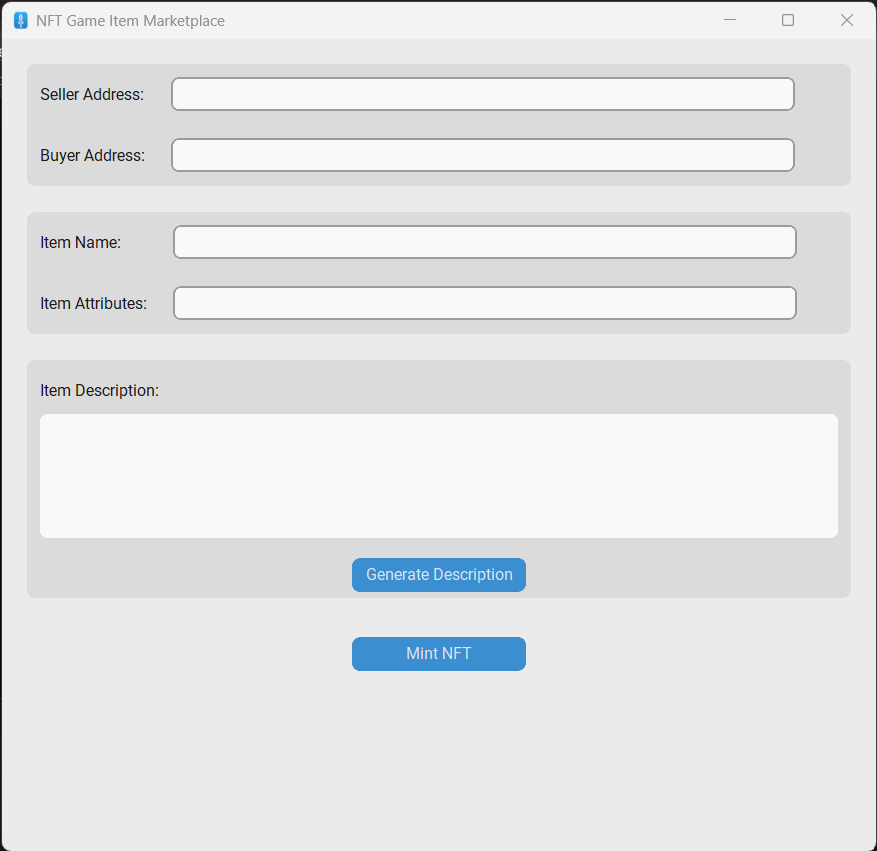

# 🎮 NFT Game Item Marketplace

A user-friendly desktop application to mint NFT game items on the Arbitrum blockchain using a custom `customtkinter` interface and `web3.py`. This project allows users to enter item details and mint game-related NFTs with just a few clicks.

---

## ✨ Features

- ✅ Mint NFTs with name, attributes, and description
- ✅ Beautiful modern GUI using `customtkinter`
- ✅ Blockchain connection via Arbitrum (Infura RPC)
- ✅ Detects gas errors and shows user-friendly popups
- ✅ Custom window logo
- ✅ Secure private key handling

---

## 🖼️ Preview



---

## 🚀 Getting Started

### 1. Clone the Repository

```bash
git clone https://github.com/yourusername/nft-game-item-marketplace.git
cd nft-game-item-marketplace
```

### 2. Install Dependencies

Make sure you have Python 3.8+ installed.
CustomTkinter
web3

### 3. Add your Infura Key and Private Key

# config.py
INFURA_URL = "https://arbitrum-mainnet.infura.io/v3/YOUR_INFURA_KEY"
PRIVATE_KEY = "YOUR_PRIVATE_KEY_HERE"  # never commit this

### 4. Run the App

python main.py

---
### 🔐 Security Note

⚠️ Never expose your private key in the code or GitHub repository. Always load it from a secure file or environment variable and keep that file excluded via .gitignore.

